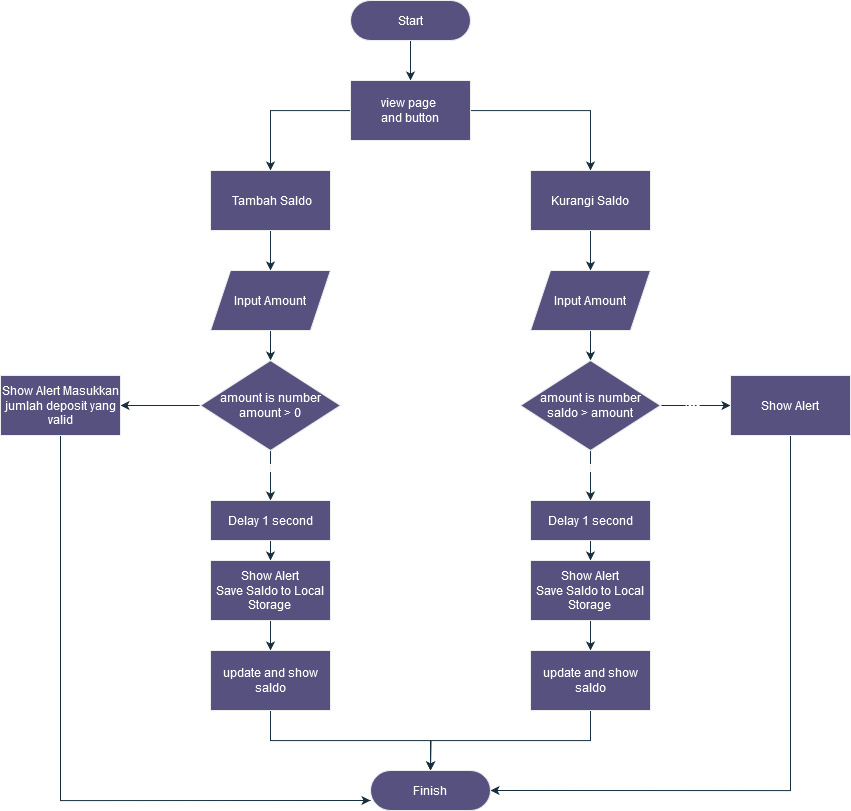

# Basic-Banking-System

Challenge Chapter 2 - Basic Banking System - Bootcamp Backend Binar Academy
## Authors

- [@wahyupambudi](https://www.github.com/wahyupambudi)

## Skill Metrics

- Programming Algorithm
- Melakukan error handling
- Menerapkan Asynchronous process
- Menerapkan OOP
- Menggunakan Git

## Delivery

- Membuat repositori baru di GitHub dengan nama "Basic-Banking-System"
- Salin file bank_account.js Challenge 1 ke direktori proyek di repositori baru
- Membuat file JavaScript baru dengan nama banking_system.js
- Implementasikan kelas BankAccount dengan metode deposit() dan withdraw()
- Gunakan setTimeout() untuk mensimulasikan operasi transaksi yang asynchronous
- Commit dan push perubahan ke repositori GitHub 

## Criteria

- Menggunakan modular class OOP (40 points)
- Mengurai proses berpikir dengan menggunakan flowchart (30 points)
- Menggunakan GitHub untuk mengelola repository (30 points)

## Steps in working on a case study

- Buatlah repositori baru di GitHub dengan nama Basic-Banking-System.
- Salin file bank_account.js dari Challenge 1 ke direktori proyek di repositori baru tersebut. File ini akan berisi definisi kelas BankAccount yang akan digunakan dalam implementasi sistem perbankan.
- Buatlah file JavaScript baru dengan nama banking_system.js. File ini akan menjadi pusat implementasi sistem perbankan menggunakan konsep OOP.
- Implementasikan kelas BankAccount dengan minimal dua metode: 
  - deposit(amount): Metode ini akan menerima jumlah uang yang akan disimpan ke dalam akun.
  - withdraw(amount): Metode ini akan menerima jumlah uang yang akan ditarik dari akun, asalkan saldo mencukupi.
- Gunakan fungsi setTimeout() untuk mensimulasikan operasi transaksi yang asynchronous. Misalnya, setelah melakukan deposit atau withdrawal, Anda dapat menunda eksekusi selama beberapa detik sebelum mengembalikan hasil operasi.

## Pseudocode

## Flowchart

